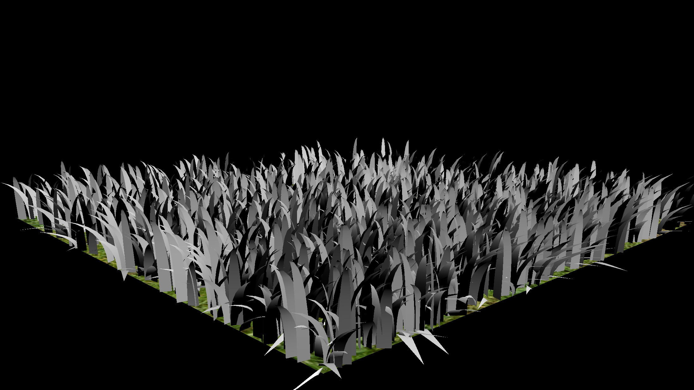
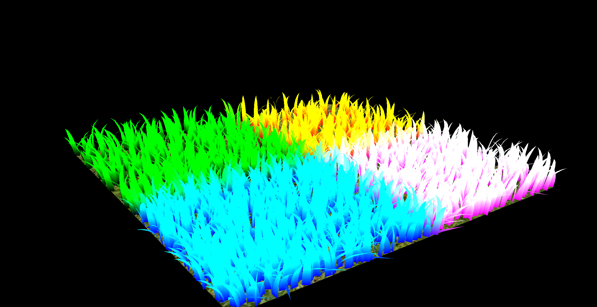
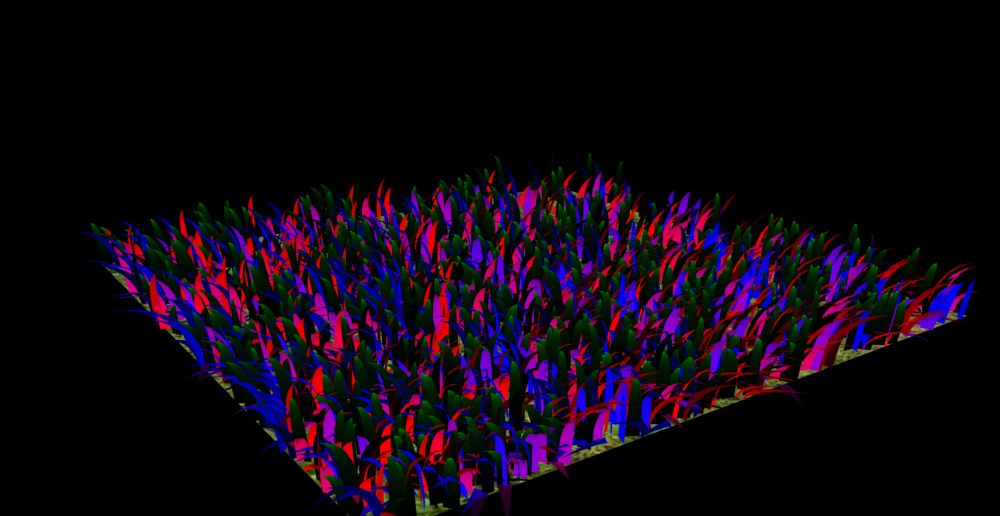
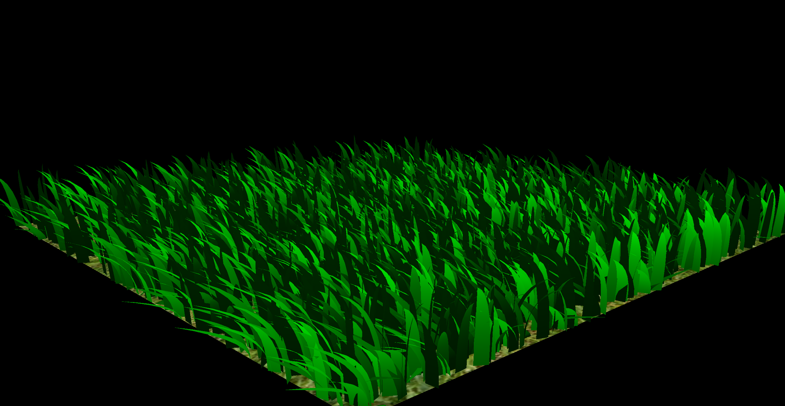
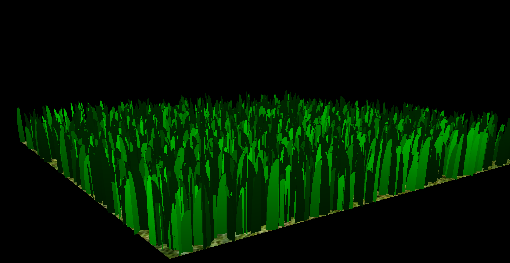
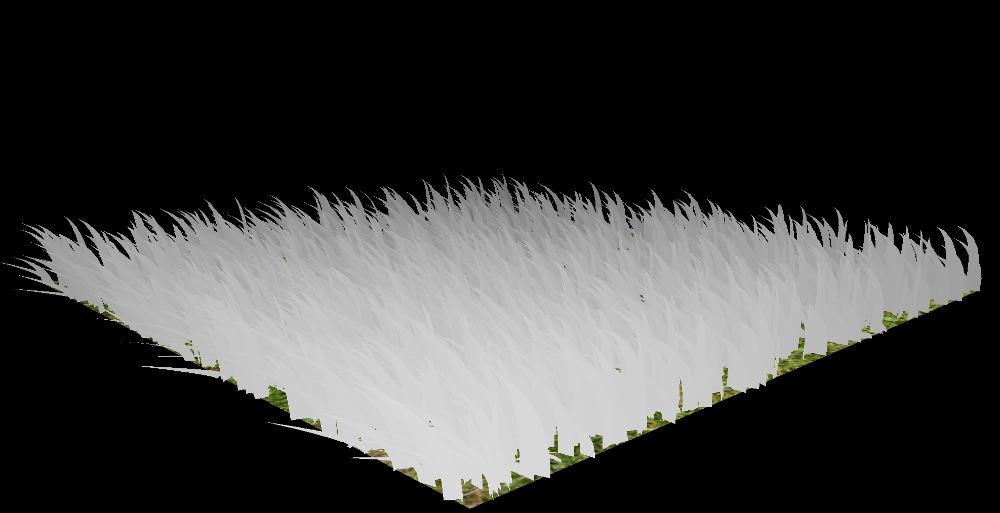
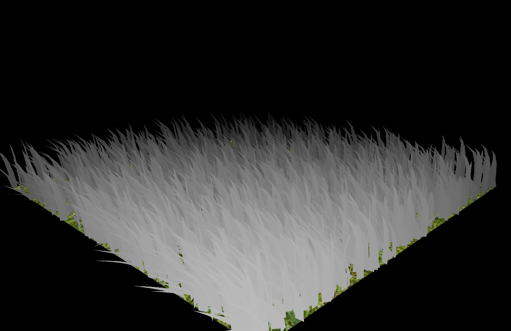

Vulkan Grass Rendering
==================================

**University of Pennsylvania, CIS 565: GPU Programming and Architecture, Project 5**

* Joanna Fisch
  * [LinkedIn](https://www.linkedin.com/in/joanna-fisch-bb2979186/), [Website](https://sites.google.com/view/joannafischsportfolio/home)
* Tested on: Windows 11, i7-12700H @ 2.30GHz 16GB, NVIDIA GeForce RTX 3060 (Laptop)

### Introduction

This project implements a grass simulation and renderer using Vulkan, based on the paper [Responsive Real-Time Grass Rendering for General 3D Scenes](https://www.cg.tuwien.ac.at/research/publications/2017/JAHRMANN-2017-RRTG/JAHRMANN-2017-RRTG-draft.pdf). It uses compute shaders to simulate forces on Bezier curves, which represent individual grass blades, and graphics shaders to dynamically tessellate and shade the grass. Key features include physics-based blade movement, culling techniques to optimize performance, and tessellation shaders to shape the grass blades.

### Features Implemented
* **Compute Shader for Physics Calculations:** Forces are applied to simulate gravity, wind, and recovery on each grass blade. Adjustments ensure blades retain realistic movement.
* **Vertex Shader:** Applies transformations to the Bezier control points, preparing the blades for tessellation.
* **Tessellation Control and Evaluation Shaders:** Dynamically generate detailed grass geometry, creating realistic curvature in blades. The evaluation shader converts tessellated patches into clip space for rendering.
* **Fragment Shader:** Handles shading based on environmental lighting, producing a natural grass appearance.
* **Resource Binding:** Storage buffers store grass blade data across frames, and descriptors manage compute pipeline resources.
* **Culling Techniques:**
  * _Orientation Culling:_ Avoids rendering blades angled perpendicular to the camera.
  * _View-Frustum Culling:_ Skips blades outside the camera view.
  * _Distance Culling:_ Limits rendering for distant blades to improve performance.
* **Extra Credit:** Variable tessellation levels based on camera distance for optimized detail.

### Project Stages
1. Initial Blade Display - Lighting
  * The grass in the rendering is lit using Lambertian shading, where ambient and diffuse lighting are combined to produce a natural effect. This shader code adjusts the grass color based on height, producing a darker green near the base and lighter green at the top, to simulate natural lighting and height effects.
<table>
  <tr>
    <td></td>
    <td></td>
    <td></td>
    <td></td>
  </tr>
 <tr>
    <td><i> Diffuse Lighting </i></td>
    <td><i> Position </i></td>
    <td><i> Normal </i></td>
   <td><i> Full Lighting </i></td>
  </tr>
  <tr>
    <td colspan="4" align="center"><i> Grass color based on height and ambient and diffuse lighting </i></td>
  </tr>
</table>

2. Physics Simulation
<table>
  <tr>
    <td></td>
    <td></td>
  </tr>
 <tr>
    <td><i> No forces </i></td>
    <td><i> With Forces </i></td>
  </tr>
  <tr>
    <td colspan="3" align="center"><i> Gravity, wind, and recovery forces affecting blade movement </i></td>
  </tr>
</table>

3. Culling Optimization
<table>
  <tr>
    <td></td>
    <td></td>
    <td></td>
  </tr>
 <tr>
    <td><i> Orientation Culling </i></td>
    <td><i> View-Frustum Culling </i></td>
    <td><i> Distance Culling </i></td>
  </tr>
  <tr>
    <td colspan="3" align="center"><i> Culling based on orientation, distance, and frustum tests </i></td>
  </tr>
</table>

4. Tesselation
  * The variable tessellation levels refine the geometry of each grass blade based on camera distance, creating a more detailed appearance without an excessive increase in the vertex count, which is critical for efficiently rendering complex scenes like grass fields.
<table>
  <tr>
    <td></td>
    <td></td>
  </tr>
 <tr>
    <td><i> Tesselation Max Distance 50 </i></td>
    <td><i> Tesselation Max Distance 30 </i></td>
  </tr>
</table>

### Performance Analysis
#### Varying Blade Counts
Testing different numbers of grass blades to analyze frame rate and memory usage, as shown in the table below:

To calculate the memory usage as a percentage of the memory budget for each heap, we use the following formula:

**Memory Usage Percentage** = (Usage / Budget) * 100

 where:
- **Usage** is the memory currently in use (in MB).
- **Budget** is the maximum available memory for that heap (in MB).

For each performance scenario, the total memory usage is calculated by summing the memory usage across all heaps and computing the overall usage percentage relative to the total budget.

| Blade Count   | FPS | Memory Usage (MB) | % of Budget |
|-------|-------------|-------------|-------------|
| 2^5   | 1958        | 57.8867       | 0.46%       |
| 2^9   | 1678        | 57.9141       | 0.46%       |
| 2^13  | 1552        | 58.8203       | 0.47%       |
| 2^17  | 329         | 73.8203       | 0.59%       |

> **Note:** Frame rate values are in frames per second (FPS).

#### Culling Performance

| Culling Technique   | FPS |
|-------|-------------|
| No Culling   | 1162        |
| Orientation Culling   | 1288        |
| View-Frustum Culling  | 1293        |
| Distance Culling  | 1385         |
| Full Culling  | 1535         |
